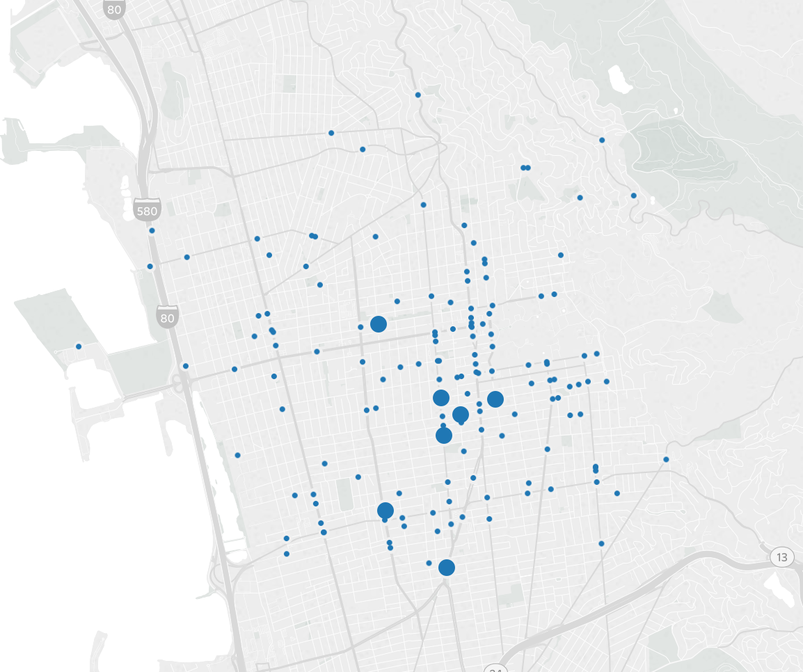

```{r setup, include=FALSE}
knitr::opts_chunk$set(collapse = TRUE)
```

With the era of web 2.0, data visualizations can be interactive, and science communication can be that much more effective. Many of the previous visualizations developed were intended to draw interest from the user by encouraging the user to engage with the visualization on the level of thinking about the content represented. By grabbing audience attention using clever graphic design, users were able to understand and consolidate the content better.

However, now that we are able to relatively easily create interactive visualizations, we can much more effectively communicate complex concepts and extend a single data visualization into a tool for conveying multiple and nuanced lessons about the data. This may not always be necessary or useful, but in cases where there are several key messages to be gleaned from the dataset, it can be.

The following data about traffic collisions in Berkeley, California can be used as a useful example.

The first image displays a map of all collisions in Berkeley in 2011 involving injury of a bicyclist. The amount of data conveyed here is limited: we might be curious about other years, about which streets, specifically were most dangerous for bicyclists, what types of collisions resulted in the most bicyclist injuries, and whether or not there was alcohol or drunk driving involved in any of these collisions.



To provide a much richer look at each of these issues, a visualization can be prepared that would be directed at a more sophisticated audience, providing the ability to engage with and browse the data.

Click on [this link](https://public.tableau.com/profile/dm4075#!/vizhome/BerkeleyCollisionsForSite/Dashboard?publish=yes) to browse the interactive visualiation.


